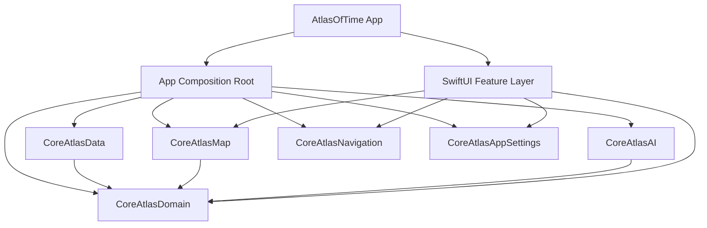

# AtlasOfTime

[](#)
[](#)
[](#)
[](#)

AtlasOfTime is an iOS historical atlas that lets users explore country borders and political context across time.

## Overview

AtlasOfTime is a SwiftUI iOS app built around explicit architectural boundaries. Domain logic, data access, map rendering, settings, and navigation are separated into local packages so the app target stays focused on composition and feature delivery.

From a product perspective, the app is a timeline-driven historical atlas. From an engineering perspective, it is a modular iOS codebase designed for maintainability, testability, and clear dependency direction.

## Current Product Scope

The app currently supports:

- scrubbing through years on a timeline
- inspecting country-level border snapshots
- opening country detail summaries
- customizing map and app preferences
- switching app language
- comparing historical states across years through timeline interaction
- searching countries

## Technical Highlights

### Clean Architecture
The codebase separates:

- domain models and use cases
- data loading and decoding
- map abstraction and provider implementation
- feature presentation
- app composition and runtime state

This keeps core behavior independent from UI and infrastructure details.

### Modular Swift Packages
Core behavior is extracted into local Swift packages:

- `CoreAtlasDomain`
- `CoreAtlasData`
- `CoreAtlasMap`
- `CoreAtlasAI`
- `CoreAtlasNavigation`
- `CoreAtlasAppSettings`

The app target remains the composition boundary rather than becoming a catch-all module.

### SwiftUI Architecture
The UI layer is built with SwiftUI and organized around feature containers, view models, controllers, and environment wiring. State ownership is explicit, and app-specific runtime behavior stays at the edge.

### Map Rendering Abstraction
Map behavior is modeled through `CoreAtlasMap`, with a concrete MapKit adapter isolated behind that boundary. Feature code depends on the map abstraction rather than directly on provider-specific rendering details.

### Swift Concurrency
Use cases and repository boundaries are implemented with Swift Concurrency, with explicit attention to:

- async contract design
- cancellation behavior
- concurrency-safe boundaries
- actor-backed test doubles
- regression coverage around concurrent flows

## Tech Stack

- Swift
- SwiftUI
- Swift Concurrency
- MapKit
- Foundation Models
- Local Swift packages
- XCTest and Swift Testing
- UserDefaults-based settings persistence
- GeoJSON + Gzip historical data pipeline

## Architecture Overview



## Project Structure

```text
AtlasOfTime/
├── AtlasOfTime/
│   ├── App/
│   ├── DI/
│   ├── Features/
│   │   ├── Home/
│   │   ├── CountryDetail/
│   │   └── Settings/
│   ├── Navigation/
│   ├── Data/
│   │   ├── Cache/
│   │   └── DataSources/
│   └── Shared/
│       ├── AppSupport/
│       └── Foundation/
├── Packages/
│   ├── CoreAtlasDomain/
│   ├── CoreAtlasData/
│   ├── CoreAtlasMap/
│   ├── CoreAtlasAI/
│   ├── CoreAtlasNavigation/
│   └── CoreAtlasAppSettings/
├── AtlasOfTimeTests/
├── AtlasOfTimeUITests/
└── docs/
```

## Package Structure

### `CoreAtlasDomain`
Core historical model and use cases.

Includes:
- entities
- use cases
- repository protocols
- domain errors

### `CoreAtlasData`
Historical data access pipeline.

Includes:
- repository implementations
- loaders
- decoders
- data errors
- cache and raw-reader seams

### `CoreAtlasMap`
Provider-agnostic map boundary.

Includes:
- map state and options
- neutral map models
- factory abstraction

### `CoreAtlasMapMapKit`
Concrete MapKit-backed map implementation.

Includes:
- overlays
- rendering
- hit testing
- selection handling
- camera updates

### `CoreAtlasAI`
Summary-generation infrastructure behind the domain summary contract.

### `CoreAtlasNavigation`
Reusable navigation primitives.

### `CoreAtlasAppSettings`
Settings state and persistence.

Includes:
- settings models
- store protocols
- `UserDefaults` persistence adapters

## Key Engineering Decisions

### App target as the composition boundary
The app target owns:

- feature composition
- runtime controllers
- environment injection
- app-specific navigation
- provider selection

Core behavior lives in packages. Composition stays at the edge.

### Packages are extracted by responsibility
Modules are split by architectural seam, not by folder structure.

That means:
- domain logic is not mixed with data loading
- settings persistence is not mixed with SwiftUI presentation
- map provider code is not mixed with feature UI

### Map provider isolation
The app depends on `CoreAtlasMap`, not directly on MapKit-specific rendering types. This keeps the rendering boundary explicit and reduces coupling between product features and provider details.

### Testing at system boundaries
The test suite focuses on boundary correctness and regression safety rather than only view-level assertions.

Coverage includes:

- package-level tests
- architecture and regression tests
- DI lifetime tests
- concurrency contract tests
- localization/resource tests
- repository behavior tests

## Status

AtlasOfTime is in active development.

The app already has working product functionality, while dataset depth, historical coverage, and feature polish continue to evolve. The engineering work is focused on keeping the codebase maintainable as the product grows.

## Roadmap

Near-term priorities include:

- improving country detail presentation
- expanding structured historical context in the detail flow
- continuing to harden package-boundary tests
- refining map interaction and presentation
- iterating on data quality and historical coverage
